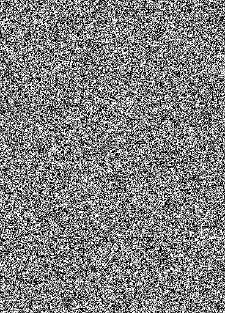
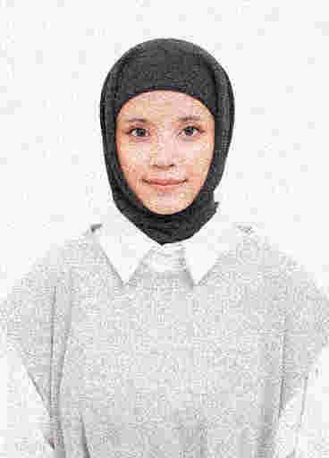
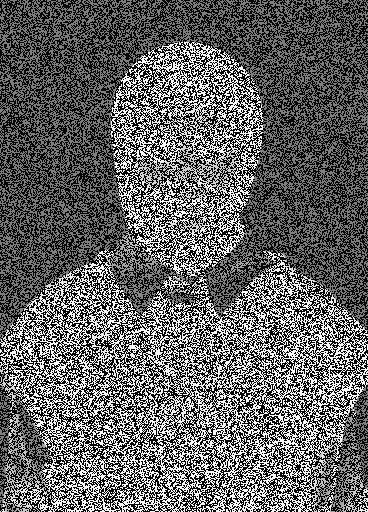

# Digital Watermarking + JPEG Compression (From Scratch)

Menyisipkan watermark ke foto wajah, mengompres dengan JPEG buatan sendiri (DCT + kuantisasi), lalu mengevaluasi seberapa tahan watermark di berbagai Quality Factor (QF).

---

## Langkah 1 — Citra Asli

Input berupa foto wajah (`face.jpg`) dalam format RGB.


---

## Langkah 2 — Sisipkan Watermark

Watermark biner {−1, +1} ditambahkan langsung ke piksel gambar:

```
I_w = clip( I + α · w , 0, 255 )     α = 20
```

| Watermark (biner) | Citra Setelah Watermark |
|:-:|:-:|
|  |  |

Perubahan piksel sangat kecil dan tidak kasat mata (PSNR ≈ 23 dB).

---

## Langkah 3 — Kompresi JPEG (From Scratch)

Citra watermarked dikompres menggunakan pipeline JPEG yang dibangun dari nol:

```
RGB → YCbCr → blok 8×8 → DCT → Kuantisasi (lossy) → IDCT → RGB
```

Semakin kecil QF, semakin besar noise yang merusak watermark.

| QF = 100 | QF = 40 | QF = 10 |
|:-:|:-:|:-:|
|  |  |  |

---

## Langkah 4 — Ekstraksi & Evaluasi

Watermark diestimasi dari selisih citra terkompresi dengan citra asli:

```
w_est = (I_compressed − I_original) / α
NC    = korelasi(w, w_est)   →   NC > 0.5 = masih bisa diekstrak
```

| QF = 100 → NC = 0.917 ✅ | QF = 10 → NC = 0.188 ❌ |
|:-:|:-:|
|  |  |

Pola watermark masih terlihat jelas di QF tinggi, dan hilang di QF rendah.

---

## Hasil Evaluasi Lengkap

| QF | NC | Status |
|:--:|:--:|:------:|
| 100 | 0.917 | ✅ |
| 70  | 0.726 | ✅ |
| 40  | 0.523 | ✅ |
| **30** | **0.445** | ❌ |
| 10  | 0.188 | ❌ |

Watermark **hilang di QF ≤ 30**.


---

## Cara Menjalankan

```bash
pip install numpy matplotlib pillow
python watermark.py
```
