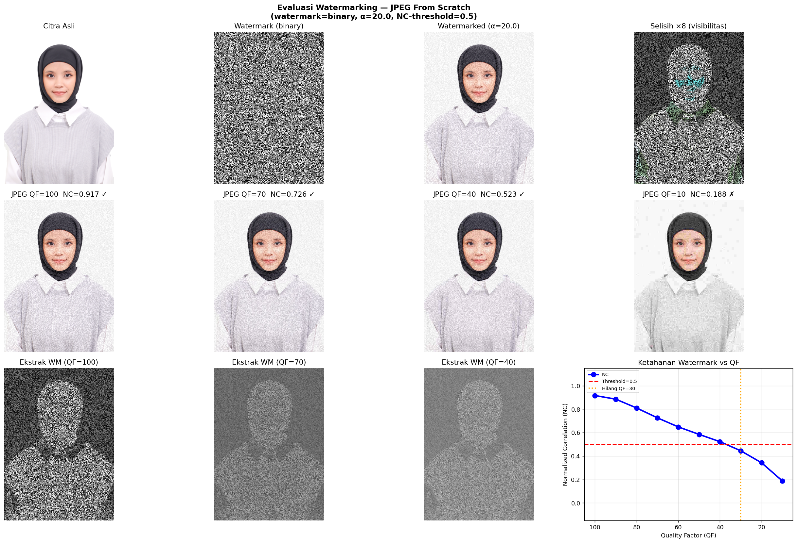

# Digital Watermarking dengan Kompresi JPEG dari Scratch

Implementasi penyisipan watermark pada foto wajah menggunakan kompresi JPEG yang dibangun dari scratch (tanpa library JPEG bawaan). Evaluasi ketahanan watermark terhadap berbagai nilai Quality Factor (QF).

---

## Input

**Foto wajah yang digunakan:**


---

## Hasil Evaluasi



Baris 1 (kiri ke kanan): citra asli, watermark biner, citra setelah watermark, selisih ×8  
Baris 2: hasil kompresi JPEG pada QF = 100, 70, 40, 10  
Baris 3: watermark yang berhasil/gagal diekstrak + grafik NC vs QF

---

## Pipeline JPEG dari Scratch

```
RGB → YCbCr → [per blok 8×8: Level Shift → DCT-II → Kuantisasi]
             → [Dekuantisasi → IDCT-II → Level Shift] → YCbCr → RGB
```

### 1. Konversi Ruang Warna (RGB → YCbCr)

Rumus ITU-R BT.601:

```
Y  =  0.299·R + 0.587·G + 0.114·B
Cb = -0.169·R - 0.331·G + 0.500·B + 128
Cr =  0.500·R - 0.419·G - 0.081·B + 128
```

Kanal Y (luminance) dikuantisasi lebih halus dari Cb/Cr (chrominance), mengikuti sensitivitas mata manusia.

### 2. Matriks DCT-II — From Scratch

Dibangun dari definisi matematis tanpa `scipy.fft.dct` atau fungsi DCT bawaan:

```
D[k,n] = sqrt(1/N)                             , k = 0
         sqrt(2/N) · cos(π·k·(2n+1) / 2N)     , k > 0
```

Karena D bersifat **ortogonal** (D⁻¹ = Dᵀ):

| Operasi | Rumus |
|---------|-------|
| Forward DCT 2D | `F = D · f · Dᵀ` |
| Inverse DCT 2D | `f = Dᵀ · F · D` |

### 3. Tabel Kuantisasi

Tabel standar JPEG (ISO/IEC 10918-1) diskalakan berdasarkan QF:

```
scale = 5000 / QF      , QF < 50
scale = 200 - 2·QF     , QF >= 50

Q = clamp( floor((Q_base × scale + 50) / 100), 1, 255 )
```

### 4. Langkah Lossy

```python
Fq = round(F / Q) * Q   # kuantisasi → dequantisasi
```

Pembulatan ini membuang detail frekuensi tinggi. Semakin kecil QF → nilai Q semakin besar → semakin banyak informasi (termasuk watermark) yang hilang.

---

## Metode Watermarking

### Penyisipan (Additive Embedding)

```
I_w = clip( I + α · w , 0, 255 )
```

- `w` = watermark biner {−1, +1} (bit {0,1} dipetakan ke {−1,+1})
- `α` = kekuatan penyisipan = **20**
- PSNR watermarked image: **23.27 dB** (tidak kasat mata)

### Ekstraksi (Non-blind)

```
w_est = (I_compressed − I_original) / α
```

Setelah JPEG: `I_compressed ≈ I + α·w + noise_JPEG`  
sehingga: `w_est = w + noise_JPEG/α`

Ketika QF rendah, `noise_JPEG` membesar → NC turun → watermark tidak bisa diekstrak.

### Metrik — Normalized Correlation (NC)

```
NC = dot(w − mean(w), w_est − mean(w_est)) / (‖w − mean(w)‖ · ‖w_est − mean(w_est)‖)
```

NC ≈ 1.0 → terekstrak sempurna | NC ≈ 0.0 → hilang | **threshold: NC > 0.5**

---

## Hasil

### Tabel NC vs Quality Factor

| QF | NC | PSNR Gambar (dB) | Status |
|:---:|:---:|:---:|:---:|
| 100 | 0.9166 | 23.20 | ✅ Terekstrak |
| 90  | 0.8856 | 23.05 | ✅ Terekstrak |
| 80  | 0.8104 | 22.89 | ✅ Terekstrak |
| 70  | 0.7262 | 23.07 | ✅ Terekstrak |
| 60  | 0.6491 | 23.45 | ✅ Terekstrak |
| 50  | 0.5850 | 23.91 | ✅ Terekstrak |
| 40  | 0.5230 | 24.40 | ✅ Terekstrak |
| **30** | **0.4452** | **25.00** | ❌ **HILANG** |
| 20  | 0.3426 | 25.50 | ❌ HILANG |
| 10  | 0.1876 | 26.93 | ❌ HILANG |

### Kesimpulan

Watermark **tidak dapat diekstrak** pada **QF <= 30**. Pada QF ini, noise akibat kuantisasi JPEG cukup besar untuk merusak korelasi antara watermark asli dan watermark yang diekstrak (NC jatuh di bawah threshold 0.5).

---

## Cara Menjalankan

**Install dependensi:**
```bash
pip install numpy matplotlib pillow
```

**Jalankan:**
```bash
# Letakkan foto wajah sebagai face.jpg di folder yang sama
python watermark.py
```

Output: tabel NC vs QF di terminal + file `watermark_evaluation.png`

**Parameter yang bisa diubah** (di bagian bawah `watermark.py`):
```python
ALPHA   = 20.0      # kekuatan penyisipan (lebih besar = lebih tahan, tapi lebih terlihat)
WM_KIND = 'binary'  # 'binary' atau 'random'
SEED    = 42        # seed untuk reproducibility
```

---

## Struktur File

```
.
├── watermark.py              # implementasi utama (JPEG + watermarking dari scratch)
├── face.jpg                  # foto wajah (input)
└── watermark_evaluation.png  # hasil evaluasi (output)
```

---

## Referensi

- Wallace, G.K. (1992). *The JPEG still picture compression standard*. IEEE Transactions on Consumer Electronics.
- Cox, I.J. et al. (2007). *Digital Watermarking and Steganography*. Morgan Kaufmann.
- Tabel kuantisasi JPEG: ISO/IEC 10918-1 Annex K
